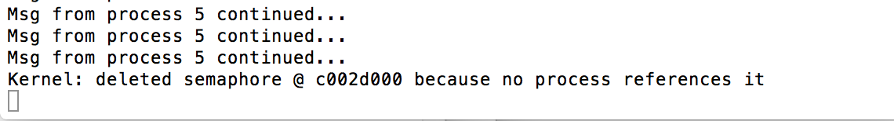

#运行在v9-cpu的os.c拆分实验概述

####计23班 杨煜 2011010312

v9-cpu是一个假想的32位RISC CPU，v9-cpu有一套自己定义的指令集，os.c是运行在这套指令集上的一个操作系统。

为了一步一步了解os.c操作系统的实现方式，赵晟佳同学完成了对os.c操作系统的拆分实验，将其拆分成8个lab以尽量做到实现与ucore_lab各lab所增加功能点之间的对应。


> 下面针对拆分后的每一个lab，与ucore对照着概括出其要完成的基本要求和在该lab中新增函数的说明。

> 在说明中会从0开始一部一部介绍os.c这个操作系统是如何一步一步增加和完善其功能，然后构件成一个具有文件系统管理的跑在虚拟虚拟机v9上的操作系统的。

##完成工作：

- v9-cpu有自己的介绍文档，运行在v9上的os.c仅在其注释了里有一些函数功能的说明，并未给出详细的说明文档。下面的文档从将os.c拆分成8文件lab1.c-lab8.c的角度给出os.c构建过程的说明文档；

- 将lab1.c-lab8.c中每一个文件所增加的函数与ucore\_lab的每一个lab的实现作对比。相比而言较复杂的ucore\_lab的实现，分析较简单的os.c实现过程中的缺陷。

- 利用os.c拆分后的8个labi.c，实现更佳有趣而且循序渐近的操作系统课程的教学方式。


##熟悉v9-cpu
在了解os.c的构建过程之前，应当先参考v9-cpu的doc文件来对这套cpu的指令集和运行过程有大致的了解：

- 寄存器
- 指令集
- 内存（分页机制等）
- I/O操作
- 中断/异常
- 应用程序二进制接口
- CPU执行过程

> 在阅读代码的过程中，建议将v9-cpu的doc文件在浏览器中打开，随时使用ctrl+f来查询指令集定义中从c代码，汇编代码，二进制代码的对应关系，了解每个labX.c中代码的意义。同时应该熟悉v9-cpu的/root/lib下的u.h, lab.h和lab_stdout.h，如页表项结构，栈帧结构，文件系统结构，进程控制块结构在这些文件中有详细的定义，在需要的时候查阅并使用。

##测试与运行方式
下载源码后在v9-cpu这个目录下运行

```./cleanup.sh```

可以清除平台相关的编译器信息。然后依次运行

```
./build.sh
./boot.sh
```

生成自己本地机器上的平台相关的`xc`,`xem`,`xmkfs`三个可执行文件并放入v9-cpu/labs文件夹下面，即可分别执行

```
./run1.sh
./run2.sh
...
./run8.sh
```
的测试文件。

# lab1.c

##简要介绍
lab1.c是os.c拆分后的第一个lab，也是了解用用c语言实现的这个工程os.c是如何跑起来的一个lab。

##新增函数分析
```
void panic(char *s)  
// 用于封装的打印提示信息
```
panic函数是一个用来报错的辅助函数

```
void trap(uint *sp, double g, double f, int c, int b, int a, int fc, uint *pc)
//lab1 中陷入中断trap函数只处理了软件中断和时钟
```
`trap()`中断处理函数，当函数需要陷入中断的时候调用该函数，参数fc传入一个中断号，`trap()`函数根据传入的参数选择相应的处理。

```
void alltraps() 
//进行中断处理，内部封装了用汇编语言传递traps()参数的过程。
```
`alltraps()`函数中在执行`trap()`函数之前几条汇编语言的代码是实现了将当前寄存器的值进行压栈操作，在完成中断处理函数`trap()`之后进行出栈操作，恢复相应的寄存器的值。最后一句asm(RTI)表示处理中断完成返回。

```
void mainc() 
//初始化中断向量表，使能中断，并设定计时器 
```
`ivec`函数传入alltraps()函数的指针，设置中断向量表的起始地址并初始化中断向量表。之后更新的lab如果要对新增的中断进行处理，只需要在traps()函数中增加case即可。

```
void main() 
//程序入口，初始化栈到临时存储区，并跳转到mainc
```
`mian()`函数建立了静态内核栈的存储空间，然后初始化了内核栈指针到`mainc()`函数的起始地址，然后通过汇编代码`asm(LEV)`跳转到改地址。

##与ucorelab对照分析
os.c在lab1.c中完成了，初始化堆栈到临时存储区，初始化中断向量表，设置定时器并在时钟中断的时候打印定时器信息。

ucorelab在Lab1中完成了：

- 生成ucore的img镜像(与os.c生成编译器相关的二进制文件相对应)；
- ucore的启动过程的bootloader初始化A20，初始化GDT表，长跳转更新CS基地址最后跳到bootmain(os.c是一个运行在虚拟CPU即软件CPU上的程序，指节从main函数处开始执行了)；
- 完善中断处理函数trap.c(os.c的lab1.c中对应完成trap()函数)；

> 因为v9不支持类似x86的ebp指针，在函数调用的过程中，只有pc被入栈，所以函数在没有执行到上次以调用的返回点的时候并不知道上一次调用栈帧的位置。所以与ucore对应的print_stackframe函数无法实现。


# lab2.c

##简要说明
ucorelab中的物理内存、虚拟内存的管理、映射和分配的问题是比较难于理解的一块问题，为此我们不妨先通过lab2.c来看一中更佳简单的物理内存、虚拟内存的设计，对实际执行过程中的操作系统的物理内存、虚拟内存的管理、映射和分配的问题有一个初步的认识。通过认识os.c内存与虚存管理的问题，再回过头来看ucorelab的物理内存、虚存的设计较为复杂的设计可以减少的问题，同时增加研究与学习的乐趣。

##os.c内存与虚存的设计
lab2.c文件的开头定义了几个重要的全局变量：

```c
char *mem_free;          // memory free list
char *mem_top;           // current top of unused memory
uint mem_sz;             // size of physical memory
uint kreserved;          // start of kernel reserved memory heap
uint *kpdir;             // kernel page directory
```

os.c这个虚拟的系统并没有为我们实现一个虚拟的外设作为虚拟内存所存在的位置。它在初始化的时候就分配了一块全空间的内存，将其中的地址从0x00000000到0x3FFFFFFF定义为物理内存的范围，而将其中的0xC0000000到0xFFFFFFFF定义为虚拟内存的范围。参照一下`lab.h`头文件中的这段定义

```
  USERTOP = 0xc0000000, // end of user address space
  P2V     = +USERTOP,   // turn a physical address into a virtual address
  V2P     = -USERTOP,   // turn a virtual address into a physical address
```

在后续的代码实现中os.c的开发者经常使用`pa = va + V2P`和`va = pa + P2V`这样的方式实现虚拟内存和物理内存地址之间的转换，这样做其实就是使用了上述定义的默认的虚拟内存和物理内存的对应关系。

当然上述对应关系只是一个初始的对应关系，os.c实现了页式内存管理，实现了包含页目录表的两级页表的机制，其中第二级映射，即给一个虚拟地址寻找其对应的物理的值的页表的初始化按照上述初始的对应关系进行(由`setupkvm()`设置内核虚存函数实现)。在后续的执行过程中这种初始的对应关系有可能被修改。

```
void setupkvm()
//用于初始化内核kernel的页表page table，建立从0xc0000000之后mem_sz大小的虚拟空间到0x00000000之后mem_sz大小物理空间的对等映射
```

在了解lab2相对于lab1新增的函数之前应当注意lab2.c开头新定义的全局变量，可以参照后面的注释理解。

```
char *mem_free;          // memory free list
char *mem_top;           // current top of unused memory
uint mem_sz;             // size of physical memory
uint kreserved;          // start of kernel reserved memory heap
uint *kpdir;             // kernel page directory
```


##新增函数分析
```
char *kalloc() 
//实现first-fit空闲页分配
```
我们刚才预定义好了物理内存和虚拟内存的范围，然后要设计这些函数对他们进行分配和管理。os.c所使用的最基本的内存分配方式是以4KB为大小的页来分配的，即使你的需求内存比4KB的量小很多，它依然会在你申请内存时候给你分配4KB的大小。分配过程是直接将`mem_top`指针增加一页，即可将这一页分配出去。

```
void kfree(char *v) 
//实现kalloc对应的页释放
```
回收内存将回收到的内存块(以页为单位)串成一个未使用链表，其链表的头指针存放在`mem_free`全局变量中。在上述kalloc的实现中，程序开始运行后一段时间后要分配新的内存，首先检查`mem_free`链表是否为空，若不空则将链表头所指向的内存块分配，更新链表头为下一个未使用位置；若空，则按kalloc的基本first-fit算法进行内存分配。


```
void mappage(uint *pd, uint va, uint pa, int perm) 
//为页创建页表项,提供建立一个新映射的功能，如果对应的PT不存在，则创建之
```
`mappage`函数用于给一个物理地址，给一个虚拟地址，在页表中创建一个映射，即页表项。或者在初始对应关系上做更新和修改。(涉及到查询该虚拟地址所对应的页表项是否存在的问题)

```
uint *walkpdir(uint *pd, uint va) 
//返回所对应的页表项
```
给一个虚地址，该函数通过查找两级页表的方式返回要找的页表项PTE。其中关键一行代码为`uint *pde = &pd[va >> 22], *pt;`c语言写的很精简，va右移22为得到前面10位在页目录表里面找表项，所找到表项中的值有作为参数传给指针pt，寻找页表中对应的页表项的值。函数中还处理了如果1级页目录中没有找到的情况。

```
char *test_alloc() 
void test_free(char *mem_block)
void alloc_check() 
//用于检测kalloc和kfree函数的正确性
```

##与ucorelab对照分析
ucore_lab各项练习：

- 实现first-fit连续物理内存分配算法(对应os.c中采用类似于first-fit的方法，实现kalloc和kfree两个函数分配空闲页)；
- 实现寻找虚拟地址对应的页表项(os.c中的walkpdir()函数)；
- 释放某虚地址所在的页并取消对应二级页表项的映射(os.c中的mappage()函数)；


# lab3
##简要说明

- 处理虚拟内存的缺页异常
- 在缺页时检查访问的地址是否合法，如果合法，则分配新页

##新增函数说明
```c
void find_victim()
//用于返回与虚拟地址virtual address对应的页表项PTE
```
`find_victim()`其实与`lab2.c`中的walkdir()基本相同。

```
void trap(uint *sp, double g, double f, int c, int b, int a, int fc, uint *pc) 
//陷入中断函数中在原有的只处理软件中断和时钟中断的基础上，
//增加了下面4个CASE，用来处理缺页异常。
    case FWPAGE:
    case FWPAGE + USER:
    case FRPAGE:        // XXX
    case FRPAGE + USER: // XXX
      # if ((va = lvadr()) >= u->sz) exit(-1);
      pc--; // restart instruction
      mappage(kpdir, va & -PAGE, V2P+(memset(kalloc(), 0, PAGE)), PTE_P | PTE_W | PTE_U);
      return;
```
os.c中处理缺页异常的方式其实很简单，新分配一页的虚存空间，在页表中新建一个页表项，建立对应关系即可。


##与ucorelab对照分析
ucorelab3各项练习：

- 给未被映射的地址映射上物理页
- 补充完成基于FIFO的页面替换算法


前面花了比较大量的篇幅介绍os.c的物理内存和虚拟内存的分配方式，在初始化的时候os.c的物理内存就和虚拟内存建立了1-1对应关系，与前者对应有价值的函数应该是lab2.c中出现的mappage函数。

os.c中由于虚拟地址和物理地址的大小相同而且在初始化的时候就建立了默认的对应关系，所以它在处理缺页异常的时候只需要新分配(新建)一个物理页给对应的虚拟页即可。ucorelab中虚拟空间比物理内存空间大，因此才有必要在缺页异常时设计使用不同种类的页面替换算法来完成这项功能。

# lab4

##简要说明
os.c在lab4.c中主要完成了：内核线程的管理与调度，创建一个内核线程，增加`fork_kthread`函数用于创建一个内核线程。

```
struct proc proc[NPROC];
struct proc *u;          // current process
struct proc *init;
```
关注`lab4.c`开头增加的上述全局变量。建立了一个大的静态数组来存放所有的进程控制块结构体proc。指针u指向的是当前进程。进程控制块的定义依然在`root/lib/lab.h`中。

##新增函数说明
```c
void yield()
//将当前进程的运行状态置为可运行状态并调度

sleep(void *chan)
//将当前进程置于等待状态，并将其设置到某个对应的等待队列上。

int ssleep(int n)
//传入一个指定的tick周期n，让当前进程休眠n个时钟周期


wakeup(void *chan)
//唤醒所有在通道上休眠的进程，
```

`wakeup()`这个过程需要对全局的进程控制块数组进行遍历，在进程数量很多的时候，运行效率可能不高。

```
struct proc *allocproc()
//创建一个新的进程控制块并返回；
```

`allocproc()`其创建过程是遍历进程控制块列表，在进程表中从前到后查询是否有未使用的进程控制块，如果有，则将其状态切换为初始化，否则返回0。显然在进程控制块数组还未填满时均可以得到新分配的进程控制块。


```
void kthread_example()
//测试进程

fork_kthread(void *entry)
//通过fork创建新的进程，并修改对应的进程块相应的信息
```
`fork_kthread`函数新创建的进程块被修改的信息包括，页目录项、大小标志、栈帧内的各项信息，进程名，进程运行状态等。

```
swtch(int *old, int new)
//切换堆栈

scheduler()
//调度器

sched()
//调度函数
```
调度函数的实现：从进程链表中循环去寻找下一个进程，直到找到下一个就绪进程(Runable)，设置其为运行态(Running)，并调用`swtch`函数切换堆栈。

```
forkret()
//在fork创建子进程之后模拟一个中断返回
```
中断返回的过程是将原来进程的栈帧信息填写到对应的存储器中，与进程调度中切换进程`swtch`的后半部分一致，这里只模拟中断返回的后半部分过程，来实现将刚创建的初始进程的初始寄存器信息写入对应的寄存器当中。

##与ucorelab对照分析
ucorelab4各项练习：

- 分配并初始化一个进程控制块(对应os.c中的allocproc函数)；
- 为新创建的内核线程分配资源(对应os.c中的fork_kthread函数)。


# lab5
##简要说明
os.c在lab5.c中创建用户进程

为了在没有文件系统的情况下存储用户程序，定义了一个全局变量```user_program```

```
// Allocate a user program area that begins with a magic string
char user_program[8192] = {'u', 's', 'e', 'r', 'p', 'r', 'o', 'g', 'r', 'a', 'm',
                           0x92, 0x23, 0x46, 0x88, 0xA6, 0xE5, 0x77, 0x02};
```

```os.c```编译后所得到的二进制程序有代码段(Code)，静态数据段(BSS)，堆栈段(DS)，user_program将成为elf文件BSS段的一部分．这时可以将其替换为制定的用户程序。

```add_program.cpp```实现了该功能。该程序的作用是在elf二进制文件中查找上面定义的magic string，如果找到，就把magic string所在的存储区替换为用户程序。同时应当将```user_program```初始化为以magic string开头，使得这段存储可以被找到。

为了避免错误，应当检查magic string出现的唯一性，并且检查存储区大小足够存放用户程序。


###lab5.c实现功能
* 修改```exec```使之从```user_program```中读取程序而不是文件系统
* 增加系统调用```yield```，进程可以通过该调用主动放弃CPU使用权
* 实现测试样例```lab5_user.c```，样例通过fork创建８个用户进程，并通过yield轮流执行，同时测试在进程程序结束时可以顺利终止

##新增函数说明
```c
int exec(char *program, char **argv) 
//从user_program中读取程序，而非文件系统

int kill(int pid)
//用以删除给定pid的进程，查看trap()函数的实现可指进程在返回其用户空间之前不会停止。

int wait()
//等待子进程退出并返还其pid，当进程不存在时返回-1

int sbrk(int n)
//以n字节为单位增加进程所占用的存储空间

int allocuvm(uint *pd, uint oldsz, uint newsz, int create)
//给占用空间增加的进程更多的页表和物理内存

int deallocuvm(uint *pd, uint oldsz, uint newsz)
//给占用空间减少的进程回收页表和物理内存。

freevm(uint *pd)
//清空页表盒所有用户态的物理内存页。

uint *copyuvm(uint *pd, uint sz)
／/为子进程拷贝父进程的页表
```

##与ucorelab对照分析
ucorelab5各项实验：

- 加载应用程序并执行(os.c中在BSS段通过add_program函数创建用户执行程序)。
- 父进程复制自己的内存空间给子进程（目前os.c中更新的fork函数）

# lab6

##简要说明
在lab5的基础上采用Round-Robin的方法调度进程，os.c从lab5到lab6的改进较少。

##新增函数说明
```c
void trap(uint *sp, double g, double f, int c, int b, int a, int fc, uint *pc)
//在中断处理函数的case FITMER + USER中增加以下内容
    wakeup(&ticks);
    // force process to give up CPU on clock tick
    if (u->state != RUNNING) { printf("pid=%d state=%d\n", u->pid, u->state); panic("!\n"); }        
    u->state = RUNNABLE;
    sched();
```

os.c实现Round-Robin算法较为简单，只需要在```trap()```中断处理函数中增加上面的内容，即在每一个时钟到来的时候都强制当前的进程放弃CPU的使用权，并调度执行下一个进程即可。

##与ucorelab对照分析
ucorelab6各项实验：

- Round-Robin-调度算法(os.c的trap函数已经实现)
- 实现Stride Scheduling调度算法(os.c中尚未实现，若要实现，可在trap()中实现，执行时候替换R-R算法)。


# lab7
##简要说明

赵晟佳对拆分后的lab7.c定义了信号量的结构体，并书写了代码来演示信号量基本原理的代码，其主要实现为

- 调用```seminit```在内核存储区创建一个信号量，
- 调用```semup```释放一个信号量或唤醒一个等待进程，
- ```semdown```获取一个信号量或者进入等待
- 在```lab7_user.c```中实现了一个简单的测试．如果去掉```semup```和```semdown```的保护，输出会变得混乱没有规律

##新增函数说明
```c
struct semaphore_t
//信号量结构定义
```
由于os.c本身并没有对信号量的实现，所以赵晟佳同学在直接将信号量定义在了拆分的lab7.c文件中。他对信号量结构体的定义包含信号量的量值value，等待该信号量的进程控制块结构体指针，等待该信号量的进程数量wait\_proc

```
struct semaphore_t *sem_init(int value)
//信号量结构存储空间初始化函数
```
给一个信号量的初始值，利用这个函数构建一个信号量，其本质是调用lab2.c中已经完成kalloc物理内存分配函数，分配一块物理内存空间来存储这个信号量的结构体，并保留它的指针。

```
void sem_up(struct semaphore_t *sem)
//释放操作，信号量的值加1

void sem_down(struct semaphore_t *sem)
//占用操作，信号量的值减1
```
`sem_up`和`sem_down`两个函数实现了信号量基本的PV操作。
赵晟佳同学在测试代码`lab7_user.c`中对上述实现做了一个简单的验证，即如果去掉```semup```和```semdown```的保护，输出会变得混乱没有规律。


##我对lab7.c的修改
赵晟佳同学在os.c中实现了信号量的基本定义，展现了信号量运行过程的基本原理，但是他并没有对新建的信号量做管理，其测试代码也只使用了一个信号量(即只在内存中kalloc一个信号量结构体)，用来给出演示结果。我的工作**新增**实现了用户信号量的一个简单管理算法以及对应的系统调用:

##我的修改和新增函数说明
```c
struct semaphore_t
//信号量结构定义

//新增
struct semaphore_t *next;         //首先把semophore组织成一个链表
  struct proc *references[NOSEMS];  //加了一个每个信号量的，指向它的进程列表。
```
在原先定义的semaphore_t结构体基础上新增一个next指针，指向另一个信号量，即把信号量组成一个链表的形式；另外根据个人习惯在结构体中重新命名了等待该信号量的的进程列表为references数组。


```
struct semaphore_t *sem_init(int value)
//信号量结构存储空间初始化函数

//新增
sem->next = sem_root;
sem_root = sem;
sem->references[0] = u;
```
在初始化的时候多了一个把这个信号量插入到一个链表里面；并将当前进程u设置成指向该信号量。

```
void sem_down(struct semaphore_t *sem)
//占用操作，信号量的值减1
```

```
void sem_up(struct semaphore_t *sem)
//释放操作，信号量的值加1

//增加
  struct semaphore_t *cur_sem = sem_root;
  while (cur_sem != 0) {
    if (cur_sem == sem) {
      break;
    }
    cur_sem = cur_sem->next;
  }
  if (cur_sem == 0) {
    printf("Semaphore not found");
    exit(-1);
  }
```
`sem_up`函数对应信号量的V操作，这里需要说明的是在os.c上述信号量的实现过程中，操作系统是在内核态创建信号量并将信号量的地址传给用户程序。在用户程序执行`sem_up`和`sem_down`的时候会返回给内核一个信号量的指针，再有内核按照这个指针指向的位置找到内存中存储的信号量结构体数组中对应的信号量进行修改。原来的代码中存在一个安全漏洞，即用户态程序可以传入一个任何类型的指针，原来的`sem_up`函数对此不作检查。现在在`sem_up`函数的开头部分增加上述代码，以确保该信号量是信号量链表中的一部分。


```
fork()
//fork函数执行过程中增加了对信号量的复制。

//增加
cur_sem = sem_root;                        
  while (cur_sem != 0) {
    for (i = 0; i < NOSEMS; i++) {
      if (cur_sem->references[i] == u) {
        for (j = 0; j < NOSEMS; j++) {
          if (cur_sem->references[j] == 0) {
            找到原先进程所指向的信号量
            cur_sem->references[j] = np;
            //让新进程也指向该信号量
            break;
          }
        }
        break;
      }
    }
    cur_sem = cur_sem->next;
  }

```
在fork进程完成对信号量复制的过程中，我们遍历所有的信号量，找到原先进程所指向的信号量。

> 讨论与分析：这种方法在信号量较少的时候不会有什么问题，在上次与陈喻老师的讨论中，如果可以更新进程控制块的数据结构，即在proc数据结构中添加一项指向某信号量的指针，这种建立信号量与对应进程之间的双向的对应关系在处理信号量数量较多的情况下比我现在的这种实现在效率上确实有更多的优势。

```
int sem_del(struct semaphore_t *sem)
//删除信号量

//该函数为新增函数
{
  struct semaphore_t *cur_sem = sem_root;
  struct semaphore_t **cur_sem_ptr = &sem_root;
  while (cur_sem != 0) {     //在链表中找这个信号量
    if (cur_sem == sem) {
      *cur_sem_ptr = cur_sem->next;
  	  kfree(sem);             //找到则释放内存并返回0
      return 0;
    }
    cur_sem_ptr = &(cur_sem->next);
    cur_sem = cur_sem->next;
  }
  return -1;                //没找到时候返回-1
}
```
对信号量的简单管理实现中增加了，给定一个信号量指针对链表中信号量的删除操作。


```
exit(int rc)
//退出进程的函数中增加了删除信号量的内容

//新增
// Remove semaphore references 
  cur_sem = sem_root;
  while (cur_sem != 0) {
    for (i = 0; i < NOSEMS; i++) {
      if (cur_sem->references[i] == u) {
        cur_sem->references[i] = 0;
        for (j = 0; j < NOSEMS; j++) {
          if (cur_sem->references[j] != 0) {
            break;
          }
        }
        if (j == NOSEMS) {
          sem_del(cur_sem);      
    	  printf("Kernel: deleted semaphore @ %x because no process references it\n", cur_sem);
        }
        break;
      }
    }
    cur_sem = cur_sem->next;
  }
```

`exit()`进程退出时候把当前信号量指向的指针删除，统计该信号量还有多少进程指向它，若没有则删除该信号量。

在`/root/lib/libc.h`第49行增加了一个系统调用

```c
semdel() { asm(LL,8); asm(TRAP, S_semdel); }   
//加了一个信号量的系统调用
```
并在trap()函数中针对`CASE S_semdel`的情形完成了各自对应函数的调用，以实现测试程序的正常运行。

##测试结果
尝试先删除信号量，第一次成功，之后就不能再继续删除了。

结束时发现已经没有进程再指向这个信号量了，所以删除该信号量


##与ucorelab对照分析
ucorelab7各项实验：

- 理解内核级信号量的实现和基于内核级信号量的哲学家就餐问题（os.c中设计了对用户信号量的简单的管理算法）；
- 完成内核级条件变量和基于内核级条件变量的哲学家就餐问题（其实在os.c中封装的semaphore_t结构体，就是一中条件变量的结构体，只是把他叫做信号量了）。


# lab8
##实验内容
os.c中lab8.c添加对文件系统的实现，其实lab8.c几乎涵盖了os.c的所有的功能。

##新增函数说明
```c
ideinit()
//初始化IDE

iderw(struct buf *b)
//读写IED

binit()
//缓冲区初始化

struct buf *bget(uint sector)
struct buf *bread(uint sector)
//寻找读取factor

int readi(struct inode *ip, char *dst, uint off, uint n)
//从inode中读取数据

struct buf *bread(uint sector)
//从磁盘的特定扇区读文件到缓冲区上

bwrite(struct buf *b)
//将缓冲区写在硬盘上

brelse(struct buf *b)
//释放缓冲区

bzero(uint b)
//将buffer区置0

uint balloc()
//分配一个磁盘块

bfree(uint b)
//释放一个磁盘快

```
##与ucorelab对照分析
ucorelab8各项实验：

- 完成读文件操作的实现(os.c中的bread(), readi()等函数)；
- 完成基于文件系统的执行程序机制的实现(lab8.c中的其它函数)

